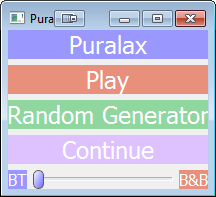
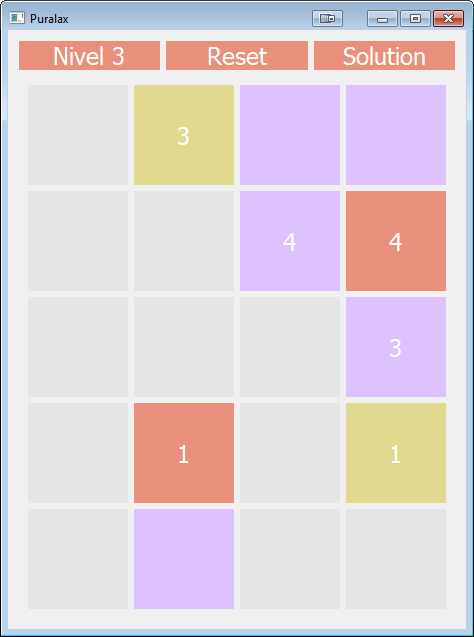

# PuralaxGame-and-Solutions (2016)

  

  

This was a proyect about the Puralax game written in c++ using QT, and also implementing Backtracking and Branch and Bound to solve it
-----------------------------------

  

  

---------------------------------

Links to Documentation (Spanish):

[How was it done](https://docs.google.com/document/d/1CUday_n9lpD1SHfb34m1TZb7-2fse8b4d0b_4Zj27VQ/edit?usp=sharing)

[Solutions](https://docs.google.com/document/d/1ddmZcQ14kEJiht3qSLA6j_DrJiPz9vPd4_3CIwfUXsc/edit?usp=sharing)
